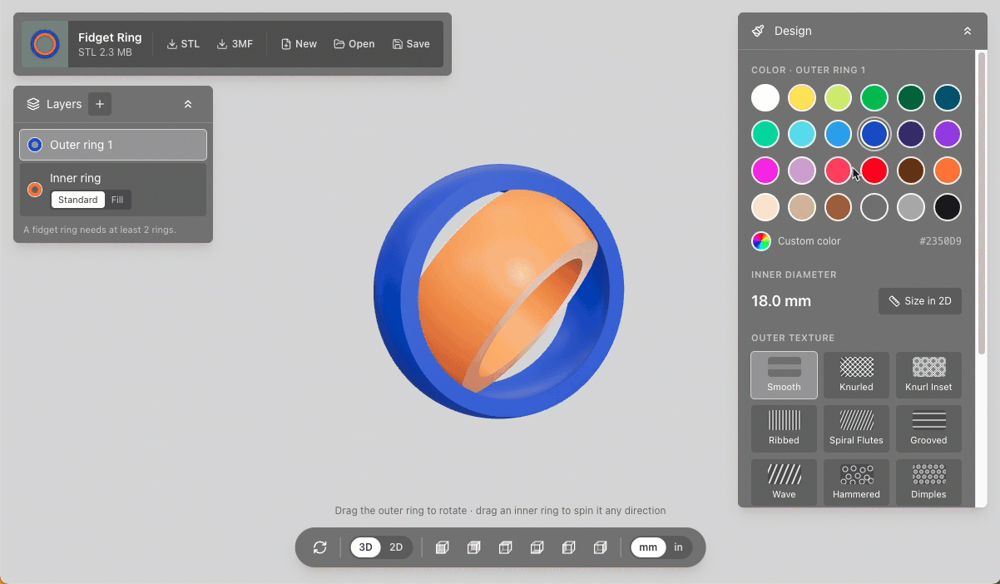

# Fidget Maker

A simple design tool for making custom fidget rings to 3D print.



Design a spinner ring of 2–5 nested rings, size it to your finger, pick colors and an outer
texture, and download a print-in-place STL or multi-color 3MF. Everything runs in the browser:
there's no server or account, and your design is saved locally between visits.

Built with React, Vite, Tailwind CSS and three.js (via React Three Fiber).

## Getting started

Requires Node.js and [pnpm](https://pnpm.io).

```sh
pnpm install
pnpm dev       # start the dev server
pnpm build     # type-check and build to dist/
pnpm preview   # serve the production build
```

## Using the app

1. **Build your layers.** The Layers box (top left) starts with an inner ring and one outer ring.
   Use **+** to add outer rings (up to 5 in total), or switch the inner ring from **Standard** to
   **Fill** for a solid spinning core instead of a finger hole. Select a layer to work on it.
2. **Style it.** In the Design panel (top right), pick a color for the selected layer from the 24
   swatches or a custom color, and choose a texture for the outer ring.
3. **Size it.** Switch to **2D** in the toolbar for a to-scale front view. Set the inner diameter
   with the drag handle, slider, number box or US ring size menu. Set each ring's thickness by
   dragging its outer handle or typing a thickness or outer diameter. The Size panel also has the
   **Limit** switch and **Ring spacing**. Use the Print bed box to check the ring fits your printer.
4. **Check it in 3D.** Drag the outer ring to orbit, drag an inner ring to spin it, or use the
   toolbar's preset views (front, back, top, bottom, left, right).
5. **Download.** From the download card, choose **STL** (one file, or a zip with one STL per part)
   or **3MF** (each ring as its own colored object). Both come out lying flat and print in place,
   so no assembly is needed.

Use **Save** to download the design as a `.fm.json` project file, **Open** to load one back, and
**New** to start over.

## Features

- **Layers:** 2–5 nested rings, each with its own color. Rings around the inner ring are named
  Outer ring 1, 2, … from the inside out, and those names carry into the exported files. You can
  delete the outermost ring or the inner ring, and the inner diameter stays the same as rings come
  and go.
- **Inner fill:** a solid core with its own color, held by a curved socket in the inner ring so it
  spins like the other rings.
- **2D sizing:** a to-scale drawing with drag handles, US ring sizes, zoom (scroll, pinch or the
  buttons) and "Fit ring" / "Fit bed".
- **Size limit:** on by default, it keeps the inner diameter at 12–30 mm and thickness at 1.2–6 mm.
  Turn it off to allow a 4–200 mm inner diameter and 0.4–50 mm thickness.
- **Ring spacing:** fixed at 0.2 mm by default. Turn Fixed off to set the spacing between every
  ring, and use Preview to see a to-scale cross-section with a close-up of the gap.
- **Print bed outline:** Bambu A1 mini (180 mm), Bambu A1 / P1S / X1C (256 mm) or Sovol SV06 Plus
  (300 mm).
- **Outer textures:** smooth, knurled, knurl inset, ribbed, spiral flutes, grooved, wave, hammered,
  dimples, dragon scale, honeycomb, triangles, squares, rectangles, herringbone and chevron. Inner
  rings are always smooth.
- **mm / inch toggle** for every measurement shown. Designs and exports are always in millimetres.
- **Exports:**
  - Binary STL, as one object or as a zip of one STL per part.
  - 3MF with a named, colored object per ring. It's about 5–6× smaller than the STL, and sets each
    ring to 100% concentric infill so it prints solid (Bambu Studio, OrcaSlicer and PrusaSlicer).
- **Projects:** `.fm.json` files. Files saved under the earlier "Fidget Ring Maker" name still open.

## How it works

The whole design is one plain object (`Design` in `src/lib/design.ts`). It holds the inner
diameter, one color per part, each ring's wall thickness, the texture, the inner fill, the size
limit and the spacing. The design flows through the app like this:

1. **State.** `src/App.tsx` owns the design and saves it to `localStorage` on every change. Edits
   go through `withValidWalls`, which clamps the diameter, thicknesses and spacing to what the
   geometry allows under the current size limit.
2. **Specs.** `computeRingSpecs` in `src/lib/ring.ts` turns the design into one spec per part, from
   the inside out. A spec is the inner and outer surface of a ring (cylinder, sphere or rounded).
   Each ring starts one clearance outside the ring within it, so a thicker ring pushes the rings
   around it outward.
3. **Meshes.** `buildRingGeometry` builds each ring's cross-section (outer surface, bottom face,
   inner surface, top face) and spins it around the Z axis into a three.js mesh. Textures push the
   outer ring's surface in and out, fading to nothing near the flat faces. Textured meshes take a
   moment to build, so the 3D view uses a deferred copy of the design and 2D dragging stays smooth.
4. **Views.**
   - `Viewer3D` renders the meshes and handles orbiting. Dragging an inner ring spins it with
     momentum, turning it so the point you grabbed follows the pointer.
   - `Designer2D` draws the same specs as a to-scale SVG, with the sizing handles and the print
     bed.
5. **Export.** `src/lib/export.ts` takes the same meshes and raises them by half the ring width so
   they sit on the bed.
   - STLs are written with three.js's `STLExporter`, and zipped with `fflate` for one file per part.
   - The 3MF is a zip that `fflate` builds by hand. It holds the XML model (one object and color per
     part) and the slicer config files that set concentric infill.

### Project layout

```
src/
  App.tsx                 app state, layer add/remove, open/save, export
  components/
    Viewer3D.tsx          3D stage, orbit controls, spinning inner rings
    Designer2D.tsx        to-scale 2D sizing view, Size and Print bed panels
    ControlPanel.tsx      Design panel: colors, texture, 2D/3D switch
    LayersCard.tsx        layer list, add/delete, Standard/Fill toggle
    ExportCard.tsx        New / Open / Save and STL / 3MF downloads
    Toolbar.tsx           reset, 2D/3D, preset views, mm/inch
  lib/
    design.ts             Design model, layers, validation, storage, project files
    ring.ts               geometry specs, size limits, textures, mesh building, ring sizes
    export.ts             STL, STL zip and 3MF writers
    printers.ts           printer bed sizes
    units.ts              mm/inch conversion and formatting
```

## Geometry

The dimensions were measured from reference STL files (kept locally in `_stl/`, which isn't in the
repo) and are implemented in `src/lib/ring.ts`:

- Every ring is 10 mm wide, with 0.2 mm between rings by default. The spacing can be 0.1–1 mm, or
  0.05–3 mm with the size limit off. With an inner fill, the maximum spacing is lower so the core
  keeps its faces.
- Where rings meet, their faces are spheres centred on the ring. That lets each inner ring turn
  freely in any direction without hitting the ring around it.
- The outside of the outer ring is rounded (13 mm radius, 1 mm crown).
- Thickness is a ring's wall at its widest. It defaults to 3.8 mm for the inner ring and 2 mm for
  the others. On small bores the inner ring has a higher minimum thickness, so its flat faces don't
  disappear where the outer sphere curves in.
- An inner fill is a solid core with a spherical outside. The inner ring's bore becomes a matching
  sphere one clearance away that still opens at the inner diameter on each face, so the core is
  held in place and spins freely.
